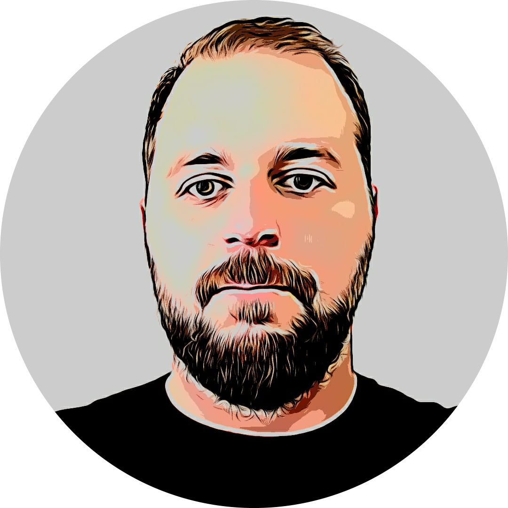
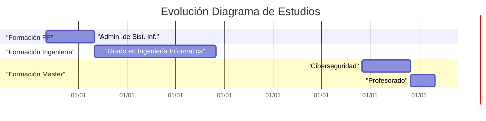

### Hi there 👋
## Información Personal

  
    
   **Nombre:** Carlos Barreda Falciano    
   
   **Email:** alu0100596113@ull.edu.es

   **Dirección:** San Cristóbal de La Laguna

## Formación 

- Ciclo Superior de Formación Profesional en Administración de Sistemas Infomáticos por IES Telesforo Bravo 2008 - 2010
- Grado en Ingeniería Informática por Universidad de La Laguna - 2010 - 2015
- Máster Ciberseguridad y Análisis de datos inteligente por Universidad de La Laguna - 2020 - 2022
- Máster en Formación del Profesorado de Educación Secundaria Obligatoria y Bachillerato por Universidad de La Laguna - 2023 - actualidad

<!--
**alu0100596113/alu0100596113** is a ✨ _special_ ✨ repository because its `README.md` (this file) appears on your GitHub profile.

Here are some ideas to get you started:

- 🔭 I’m currently working on ...
- 🌱 I’m currently learning ...
- 👯 I’m looking to collaborate on ...
- 🤔 I’m looking for help with ...
- 💬 Ask me about ...
- 📫 How to reach me: ...
- 😄 Pronouns: ...
- ⚡ Fun fact: ...
-->
